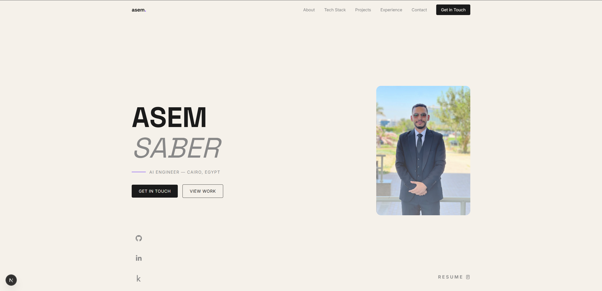

# Asem Saber — Portfolio

Personal portfolio website showcasing my work as an AI Engineer.



## Built With

- **Next.js 16** — React 19, App Router, Turbopack
- **Tailwind CSS v4** — Utility-first styling
- **GSAP** — Scroll-triggered animations and page transitions
- **Lenis** — Smooth scroll

## Sections

- **Hero** — Introduction with animated text reveal
- **About** — Bio, highlights, and stats
- **Tech Stack** — Scrolling icon rows with hover tooltips
- **Projects** — Featured project list with floating thumbnail on hover, individual detail pages with key features
- **Experience** — Timeline of work, training, and education
- **Contact** — Email and resume links

## Getting Started

```bash
npm install
npm run dev
```

Open [http://localhost:3000](http://localhost:3000).

## Deployment

Deploy to [Vercel](https://vercel.com) — zero config for Next.js.

## License

This project is provided as-is for personal use.

## Contact

- **Email:** asem.saber.ai@gmail.com
- **GitHub:** [Asem-Saber](https://github.com/Asem-Saber)
- **LinkedIn:** [Asem Saber](https://www.linkedin.com/in/asem-saber-8657a6278)
- **Kaggle:** [asemsaber](https://www.kaggle.com/asemsaber)
